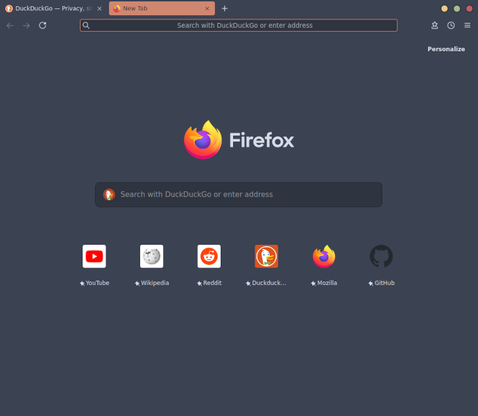

# Fjordic

A custom userChrome.css for Firefox 89+ using the Nord color palette.

Tested on Fedora 33 only.

  

# Installation

1. Set *toolkit.legacyUserProfileCustomizations.stylesheets* to **true** in *about:config*;

2. Create folder *chrome* in your Firefox profile directory and copy everything from *src* into it;

3. Restart Firefox.

# Credits

1. [Nord color palette](https://github.com/arcticicestudio/nord);

2. [GTK theme 'Nordic'](https://github.com/EliverLara/Nordic);

3. [FirefoxCSS](https://old.reddit.com/r/FirefoxCSS).
